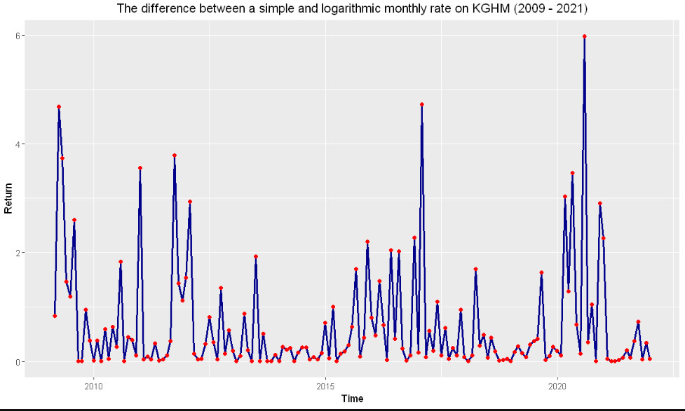
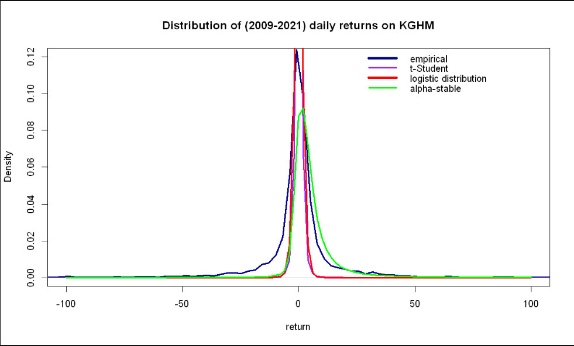
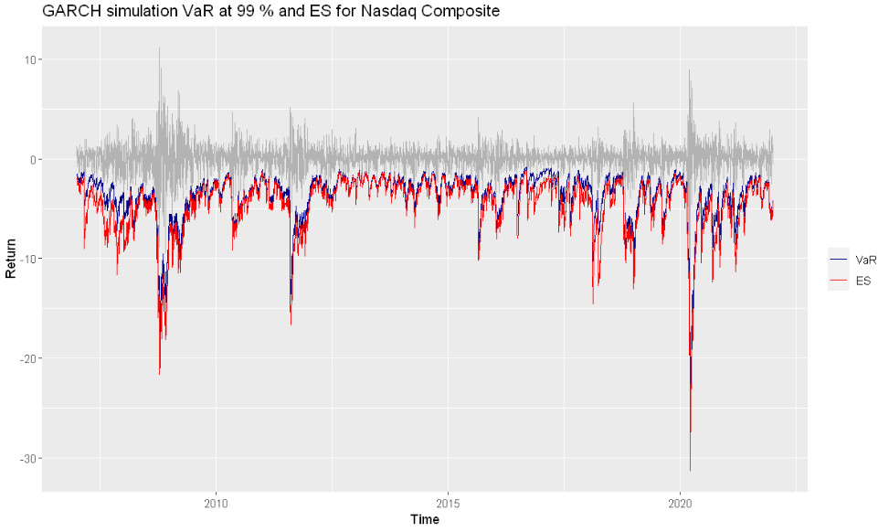

# Quantitative measures of market risk
## Description
This project was made for the Quantitive measures of market risk course at the AGH UST in 2021/2022.
All provided code is result of my work after hours, when I was solving given tasks (topics).

## Topics
**Analysis of Features Affecting Rate of Return**
- simple rate of return
- logarithmic rate of return
- Shapiro-Wilk test
- Anderson-Darling test
- Jarque-Bera test
- Distribution of returns

**Credit risk reduction models**
- company rating

**Review of Value at Risk estimation methods**

a) VaR and ES calculation methods:
- Historical
- Weighted historical
- EWMA
- GARCH

b) Backtesting methods:
- Christoffersen test
- Kupiec test

**Portfolio VaR Calculation and Correlation Monitoring**
- Correlation monitoring
- VaR calculation for portfolio (EWMA and GARCH)

## Technology stack
- R programming language (obligatory)
- Jupyter Notebook

## Data source
- Yahoo Finance https://finance.yahoo.com/
- Stooq https://stooq.pl/
